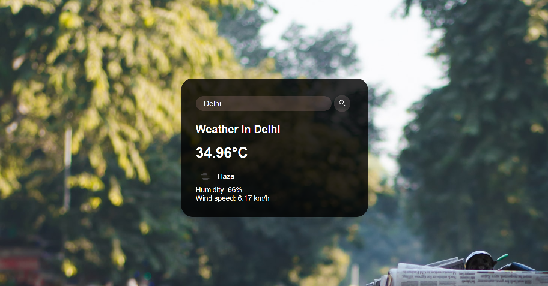
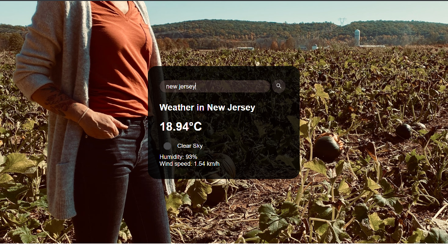

# Weather App in Javascript<h2>

A simple **Weather App** written in **Vanilla Javascript** which predicts the weather of a particular place by fetching weather data using **Open Weather Map** (https://openweathermap.org/) API and displays it.

# Functionality<h2>

<h2>The app shows the following results:</h2>

- **Temperature of the place**
- **Humidity**
- **Wind Speed**
- **Climate state**

---

- The main page of the app is shown:

- Once we type a city/country name it displays the **temperature** , **humidity** , **wind speed** and the **climate state** of the searched place.
- For eg:

- Another eg:

## Problems yet to be fixed:

The app does not give accurate results about minute places like specific towns and localities inside a city.

# To Run the App

- Fork and Clone
- Copy the path of the _weather.html_ file
- Paste the path in the browser
